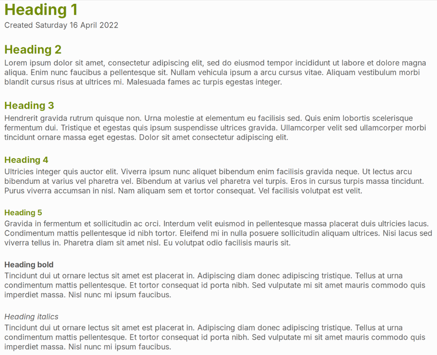
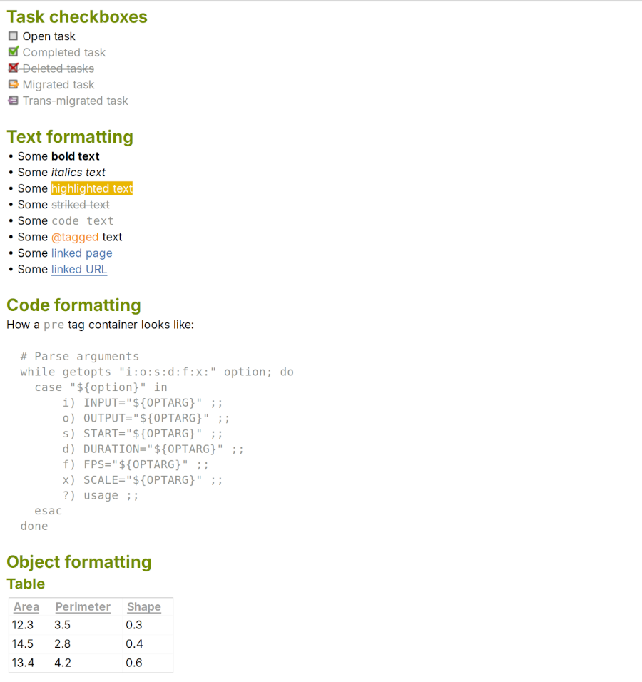
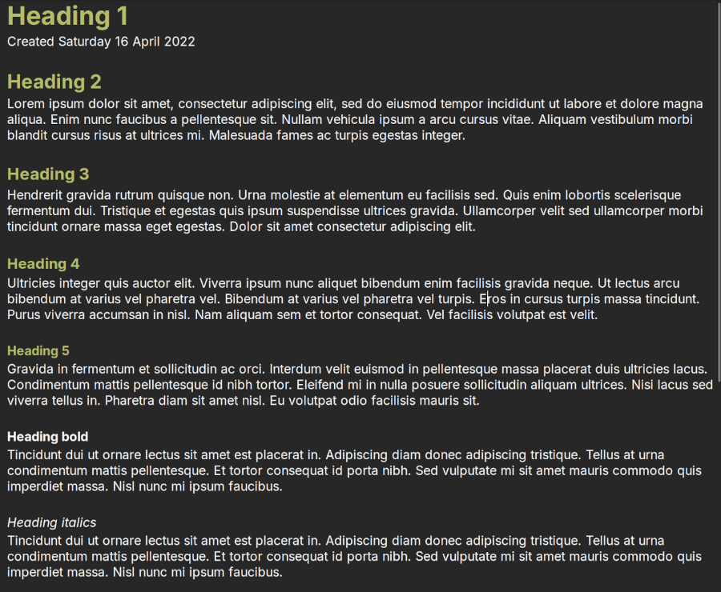
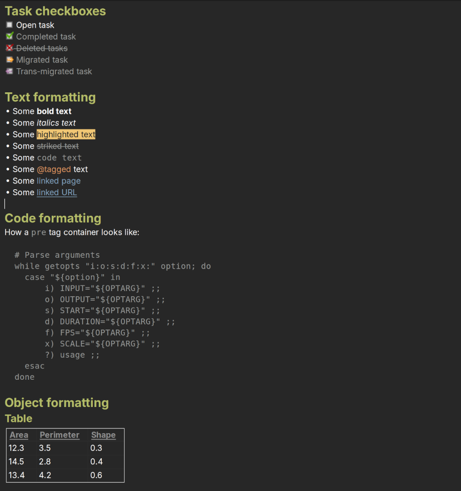

# :shorts: Zim Styles

My personal style/colorscheme configuration files for Zim Desktop Wiki.

- [`Test_page_for_Zim_styles.txt`](Test_page_for_Zim_styles.txt): Zim page filled with contents to test styles.
- [`style.conf.tomorrow-light`](style.conf.tomorrow-light): Zim style using the [Tomorrow (light)](https://github.com/chriskempson/tomorrow-theme?tab=readme-ov-file#tomorrow) colorscheme.
- [`style.conf.tomorrow-night`](style.conf.tomorrow-night): Zim style using the [Tomorrow Night (dark)](https://github.com/chriskempson/tomorrow-theme?tab=readme-ov-file#tomorrow-night) colorscheme.

## Tomorrow (light)

## Tomorrow Night (dark)

